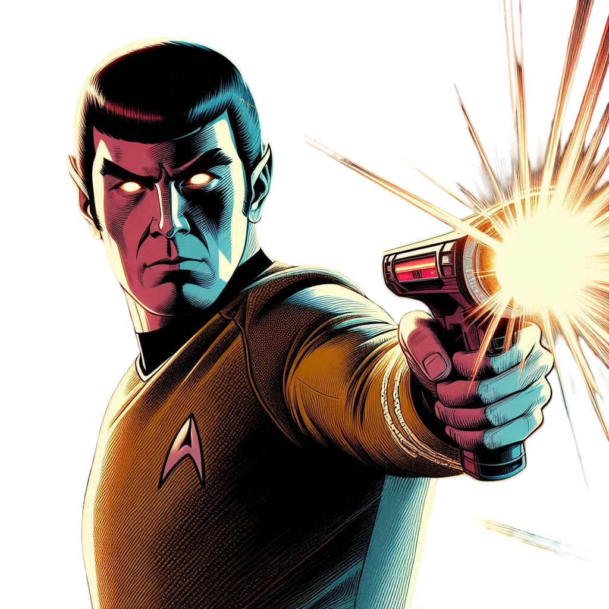

# **Rock Paper Scissors Lizard Spock - Planning Document**

## **📌 Project Overview**

This project is a digital implementation of **Rock Paper Scissors Lizard Spock**, designed for **engaging gameplay**, **accessible UI**, and **multiplayer functionality**. The goal is to build an interactive experience that evolves beyond a basic game.

## **🛠 Planning Stages**

### **Phase 1: Minimum Viable Product (MVP)**

The MVP ensures a **fully functional game** with essential mechanics.

#### **✅ Core Features**

-   Players select **Rock, Paper, Scissors, Lizard, or Spock**.
-   Game **determines a winner** based on predefined rules.
-   AI **randomly selects** an option for single-player mode.
-   Basic **UI for selections, results, and stats tracking**.
-   Scoreboard to display **win/loss count per session**.

#### **🎯 Goals**

-   Build a **JavaScript game engine** that enforces the Rock Paper Scissors Lizard Spock rules correctly using clear logic.
-   Create an **HTML/CSS interface** for user selections and displaying results.
-   Ensure the UI is **clear, responsive, and easy to navigate**.
-   Provide basic **feedback** (text-based results).

#### **🔨 Development Tasks**

-   [ ] Implement core **game logic** (winning conditions & outcomes).
-   [ ] Create UI **for selection, results, and stats tracking**.
-   [ ] Develop **AI opponent** with random selections.
-   [ ] Build session-based scoreboard to track wins/losses.
-   [ ] Test for **functionality and accuracy**.

---

### **Phase 2: Enhancements & Bonus Features**

Once the MVP is solid, **gameplay and UI improvements** enhance engagement.

#### **🌟 Gameplay Enhancements**

-   [ ] Animated **visual feedback** when players win/lose.
-   [ ] Match **history tracking** (past rounds).
-   [ ] Adjustable AI **difficulty levels** (Easy, Medium, Hard).
-   [ ] **Tournament mode** (multiple rounds for a championship).
-   [ ] **Survival mode** (track longest win streak).

#### **🎨 UI/UX Features**

-   [ ] **Dark mode toggle** for accessibility.
-   [ ] Optimized **mobile responsiveness**.
-   [ ] **Custom themes** (sci-fi, fantasy, retro skins).
-   [ ] **Sound effects and background music**.

#### Social Features\*\*

-   [ ] **Leaderboards** to compare scores.
-   [ ] **Social sharing** for posting results.

#### **📊 Analytics & Insights**

-   [ ] **Choice tracking** (show most-used selections).
-   [ ] **Odds calculator** (probability breakdown).
-   [ ] **Achievements or badges** for milestones.

#### **🔨 Development Tasks**

-   [ ] Implement **animations** for interactive feedback.
-   [ ] Add **sound effects** and enhance UI responsiveness.
-   [ ] Develop **multiplayer connectivity** for local and online play.
-   [ ] Improve accessibility features (dark mode, labels, mobile optimizations).
-   [ ] Test and refine **user engagement improvements**.

---

### **Phase 3: Advanced Features (Stretch Goals)**

These **stretch goals** push the project beyond expectations, making it deeply interactive and highly customizable.

#### **⚡ Customization & Expansion**

-   [ ] **Rule customization** (players modify interactions).
-   [ ] Unlockable **Easter eggs** or hidden mechanics.
-   [ ] **Story mode** (narrative-driven gameplay).
-   [ ] **Power-ups or special abilities** (strategy mechanics).
-   [ ] **Customizable avatars** for personalization.

#### **🎯 Goals**

-   Expand the **game’s strategy elements**.
-   Offer **personalization options**.
-   Make the experience **highly interactive**.

#### **🔨 Development Tasks**

-   [ ] Add **customizable gameplay settings**.
-   [ ] Implement **unlockable achievements and challenges**.
-   [ ] Develop **narrative-driven progression** for engagement.
-   [ ] Test **advanced features for balance and stability**.

---

## **📌 Roadmap Summary**

**MVP (Phase 1)** → **Fully playable game** with AI, selections, basic scoring.  
**Enhancements (Phase 2)** → **Expanded UI, multiplayer, animations, engagement improvements**.  
**Stretch Goals (Phase 3)** → **Customization, power-ups, advanced strategic mechanics**.

---

**some ideas**
{ width="180" }

"Ahh, you chose rock. Predictable, yet flawed. For as science dictates… Spock vaporizes rock."

"Paper? A curious selection. It may refute rock, but against my intellect… Spock disproves paper."

"Scissors. Sharp, but ultimately outmatched. You see, Spock smashes scissors—quite decisively, I might add."

"Ahh, the lizard. A most unfortunate choice. It is well documented that lizard poisons Spock… but I anticipated this, and thus Spock prevails."

"You played Spock? Fascinating. A statistically sound decision. And yet, we find ourselves at an impasse—Spock cannot defeat Spock. A true test of logic."

---

<<<<<<< HEAD

Planning Day 2:

gameboard: shift buttons and canvas: frame layout, header footer. translucent against a starry background* 

game difficulties: change red shirt to always winning diff, kirk being normal game and spock being impossible to win only drawn lose. 

star trek "space" colours: blacks blues navy colours.  like star print background, dark blues/greys bright highlights as "officer yellow" engineer "blue" 
fonts Orbitron, mychroma, Roboto 

=======
---
>>>>>>> main
