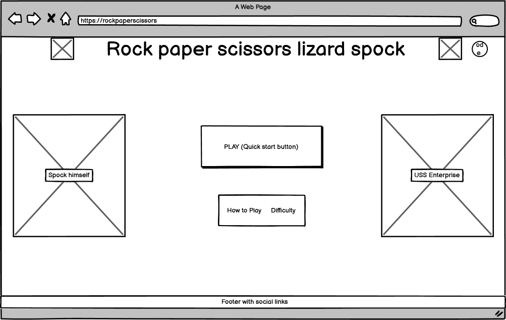
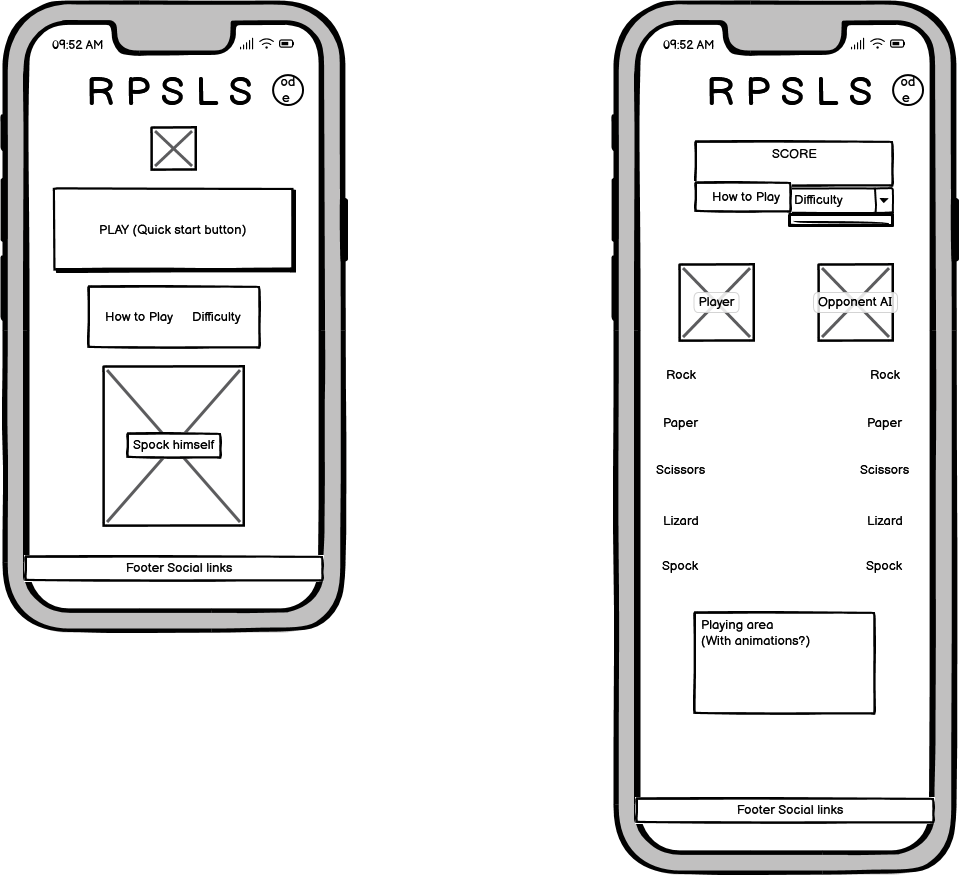
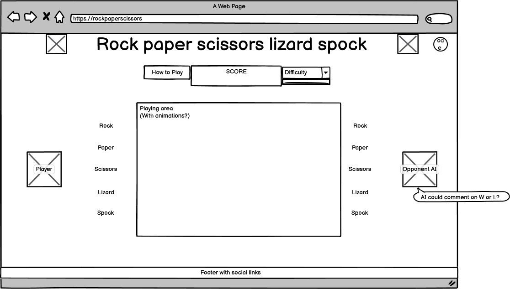

# Challenge of the Vulcan Mind

A Star Trek–themed Rock-Paper-Scissors-Lizard-Spock game with multiple play modes, real-time leaderboard, and a modern, responsive UI. Built with HTML, CSS (Bootstrap), and JavaScript.

---

## 🖼️ Website Mockup


---

## 🌐 Deployed Site

[https://tbragg88.github.io/Rock-Paper-Scissor-Group/](https://tbragg88.github.io/Rock-Paper-Scissor-Group/)

## Table of Contents

-   [About](#about)
-   [Features](#features)
-   [Game Modes](#game-modes)
-   [How to Play](#how-to-play)
-   [Screenshots](#screenshots)
-   [Leaderboard](#leaderboard)
-   [Installation](#installation)
-   [Usage](#usage)
-   [Firebase Setup](#firebase-setup)
-   [Technologies Used](#technologies-used)
-   [Development & Planning](#development--planning)
-   [Known Issues / Roadmap](#known-issues--roadmap)
-   [How AI Was Used](#how-ai-was-used)
-   [Partial Integrations](#partial-integrations)
-   [Features Considered But Not Included](#features-considered-but-not-included)
-   [Code & Accessibility Validation](#code--accessibility-validation)
-   [Credits](#credits)
-   [License](#license)
-   [Contributing](#contributing)

---

## About

**Challenge of the Vulcan Mind** is an interactive, browser-based game that reimagines Rock-Paper-Scissors-Lizard-Spock with a Star Trek twist. Face off against computer-controlled opponents modeled after iconic Star Trek characters, each with their own AI difficulty and play style. Choose from Classic or Campaign modes, test your logic and strategy, and see how you rank on a real-time global leaderboard powered by Firebase. Featuring a modern, responsive interface and immersive Star Trek visuals, this game offers both nostalgia and a fresh challenge for fans and newcomers alike—all in single-player mode.

---

## Features

-   ✅ **Classic Rock-Paper-Scissors-Lizard-Spock Gameplay:**  
    Enjoy the expanded version of the classic game, adding Lizard and Spock for more strategic depth and fun interactions.

-   ✅ **Real-Time Leaderboard Powered by Firebase:**  
    Compete globally—your scores are instantly updated and visible to all players, fostering friendly competition.

-   ✅ **Multiple Game Modes:**

    -   **Classic:** Play a quick match against the Kirk AI.
    -   **Campaign:** Progress through a series of increasingly challenging Star Trek–themed AI opponents.
    -   **Choose Opponent:** Select your rival (Redshirt, Kirk, or Spock) or play against a friend.

-   ✅ **Adjustable AI Difficulty:**  
    Choose from Easy (AI intentionally loses), Medium (random moves), or Hard (AI tries to win), tailoring the challenge to your skill level.

-   ✅ **Responsive, Mobile-Friendly Design:**  
    The interface adapts seamlessly to desktops, tablets, and phones, ensuring a smooth experience on any device.

-   ✅ **In-Game Rules & Explanations:**  
    Access a modal at any time for clear, concise explanations of game rules and winning combinations.

-   ✅ **Star Trek–Themed UI:**  
    Immerse yourself in a visually rich interface inspired by Star Trek, featuring custom avatars, color palettes, and Bootstrap-powered layouts.

-   ✅ **Animated Feedback & Sound Effects:**  
    Enjoy engaging animations and audio cues for every move and outcome (with more effects coming soon).

-   ✅ **Accessibility & Usability:**  
    Designed with accessibility in mind, including keyboard navigation, sufficient color contrast, and screen reader support.

-   ✅ **Easy Setup & Play:**  
    No installation required—just open the site and start playing!

---

## Game Modes

**Challenge of the Vulcan Mind** offers several engaging ways to play, each with unique Star Trek–themed twists:

-   **Classic Game:**  
     Jump straight into a quick match against the Kirk AI. This mode is perfect for casual play—select your move and see if you can outwit the computer in a single round or best-of series.

-   **Campaign Mode:**  
     Embark on a journey through the ranks of Star Trek’s most iconic characters. Each level introduces a new AI opponent with increasing difficulty and distinct play styles. Progress by defeating each rival to unlock the next challenge, testing your logic and adaptability.

-   **Choose Opponent:**  
     Customize your experience by selecting your rival—face off against Redshirt (easy), Kirk (medium), or Spock (hard), or challenge a friend in local two-player mode. This mode lets you tailor the challenge or enjoy friendly competition.

-   **Difficulty Settings:**  
     Adjust the AI’s behavior to match your skill level:
    -   _Easy:_ The AI intentionally makes losing moves, ideal for learning the ropes.
    -   _Medium:_ The AI selects moves at random, offering a fair and unpredictable challenge.
    -   _Hard:_ The AI analyzes your patterns and tries to win, providing a true test of strategy.

Each mode is designed to be accessible and fun, whether you’re a Star Trek fan or new to Rock-Paper-Scissors-Lizard-Spock!

---

## How to Play

Follow these steps to enjoy **Challenge of the Vulcan Mind**:

1. **Start the Game:**  
   From the main menu, select your preferred game mode—Classic, Campaign, or Choose Opponent. Each mode offers a unique Star Trek–themed experience and different AI challenges.

2. **Select Your Move:**  
   On your turn, choose one of the five options: **Rock**, **Paper**, **Scissors**, **Lizard**, or **Spock**. Each move has strengths and weaknesses—hover over or tap the icons for quick tips, or open the Rules modal for a full breakdown.

3. **Face Your Opponent:**  
   The computer (or your chosen rival) will simultaneously select their move. In Campaign mode, you’ll encounter AI opponents with increasing difficulty and distinct play styles.

4. **Determine the Winner:**  
   The game instantly compares both moves using the expanded Rock-Paper-Scissors-Lizard-Spock rules. Animated feedback and sound effects highlight the outcome—win, lose, or draw.

5. **Advance or Replay:**

    - In **Classic Mode**, play single rounds or best-of series for quick fun.
    - In **Campaign Mode**, win rounds to progress through a series of Star Trek characters, each more challenging than the last.
    - In **Choose Opponent**, select your rival’s difficulty or play locally with a friend.

6. **Submit Your Score:**  
   After each match, enter your name to submit your score to the real-time global leaderboard. See how you rank against players worldwide!

7. **Explore Features:**  
   Use the "Rules" button at any time for a refresher on game mechanics. Adjust AI difficulty, toggle dark/light mode, and enjoy the Star Trek–inspired interface on any device.

**Tip:** Experiment with different strategies and opponents to master the game and climb the leaderboard!

---

## Screenshots

<!-- Add your screenshots or GIFs here -->




---

## Leaderboard

Show off your skills and see how you stack up against players worldwide! After each game, you'll have the opportunity to enter your name and submit your score to the global leaderboard. The leaderboard is powered by Firebase and updates in real time, so you can instantly view your ranking as well as the scores of other challengers. Compete for the top spot, track your progress, and challenge friends to beat your high score. Whether you're aiming for bragging rights or just want to see how you compare, the leaderboard adds a competitive edge to every match!

---

## Installation

Follow these steps to set up and run **Challenge of the Vulcan Mind** locally:

1. **Clone the repository to your computer:**

    ```sh
    git clone https://github.com/yourusername/rock-paper-scissor-group.git
    ```

    Replace `yourusername` with your actual GitHub username if you have forked the project.

2. **Navigate to the project folder:**

    ```sh
    cd rock-paper-scissor-group
    ```

3. **Open the game in your browser:**
    - Locate the `index.html` file in the project directory.
    - Double-click `index.html`, or right-click and choose "Open with" followed by your preferred web browser.

No additional installation or dependencies are required. The game runs entirely in your browser—just open the file and start playing!

---

## Usage

To get started with **Challenge of the Vulcan Mind**, follow these steps:

1. **Launch the Game:**  
   Open `index.html` in your preferred web browser, or visit the [deployed site](https://tbragg88.github.io/Rock-Paper-Scissor-Group/).

2. **Choose a Game Mode:**  
   Select from Classic, Campaign, or Choose Opponent modes on the main menu. Each mode offers a unique Star Trek–themed challenge.

3. **Play the Game:**

    - Select your move (Rock, Paper, Scissors, Lizard, or Spock) by clicking the corresponding icon.
    - The AI or your chosen opponent will make their move simultaneously.
    - Animated feedback and sound effects will indicate the outcome of each round.

4. **View Game Rules:**  
   Click the "Rules" button at any time to open a modal with detailed explanations of the game mechanics and winning combinations.

5. **Submit Your Score:**  
   After each match, enter your name when prompted and submit your score to the real-time global leaderboard.

6. **Explore Additional Features:**
    - Adjust AI difficulty to match your skill level.
    - Toggle between dark and light mode for your preferred viewing experience.
    - Enjoy the responsive, accessible interface on any device.

**Tip:** Try different strategies and opponents to improve your ranking and master the expanded Rock-Paper-Scissors-Lizard-Spock gameplay!

---

## Firebase Setup

To enable the real-time leaderboard on your own deployment, follow these steps:

1. **Create a Firebase Project:**  
   Go to the [Firebase Console](https://console.firebase.google.com/) and create a new project. Give it a name and follow the setup instructions.

2. **Enable the Realtime Database:**

    - In your Firebase project dashboard, navigate to **Build > Realtime Database**.
    - Click **Create Database** and choose a location.
    - Start in **test mode** for development (you can update security rules later).

3. **Set Database Rules:**  
   For testing or development, set your database rules to allow public read and write access. In the **Rules** tab, replace the default rules with:

    ```json
    {
        "rules": {
            ".read": true,
            ".write": true
        }
    }
    ```

    > **Note:** These rules are insecure for production. For a live site, restrict access appropriately—see the [Firebase Security Rules documentation](https://firebase.google.com/docs/rules) for guidance.

4. **Get Your Firebase Config:**

    - In the Firebase Console, go to **Project Settings > General**.
    - Under **Your apps**, select **Web app** (</>) and register your app if you haven't already.
    - Copy the Firebase configuration object (it looks like `apiKey`, `authDomain`, etc.).

5. **Update Your Project:**

    - Open `assets/javascript/index.js` in your project.
    - Find the `firebaseConfig` object and replace its contents with your own config from the previous step.

6. **Run the Game:**
    - Open `index.html` in your browser.
    - Play a game and submit a score to verify that the leaderboard updates in real time.

**That's it!** Your deployment will now use your own Firebase backend for the leaderboard. For additional customization or troubleshooting, refer to the [Firebase documentation](https://firebase.google.com/docs/).

---

## Technologies Used

-   **HTML5** – Structure and markup for the web application.
-   **CSS3** (with [Bootstrap 5](https://getbootstrap.com/)) – Styling, layout, and responsive design.
-   **JavaScript (ES6)** – Game logic, interactivity, and UI behavior.
-   [**Firebase Realtime Database**](https://firebase.google.com/) – Real-time leaderboard and data storage.
-   [**FontAwesome**](https://fontawesome.com/) – Iconography throughout the UI.
-   **DALL-E** – AI-generated imagery for custom visuals.
-   **Lighthouse** – Accessibility and performance auditing.
-   **W3C Markup Validation Service** – HTML validation and code quality checks.
-   **GitHub Copilot** – AI-assisted code and content generation.
-   **VS Code** – Primary code editor for development.

---

## Development & Planning

See [PLANNING.MD](PLANNING.MD) for a full breakdown of project phases, features, and roadmap.

**Highlights:**

-   MVP: Core game logic, UI, and session-based scoring.
-   Enhancements: Animations, sound, difficulty, multiplayer, leaderboards.
-   Stretch Goals: Custom rules, story mode, power-ups, achievements.

---

## Known Issues / Roadmap

-   [ ] Campaign and Choose Opponent modes are in progress.
-   [ ] Accessibility improvements planned.
-   [ ] More Star Trek themed sound effects and animations coming soon!
-   [ ] Advanced features (custom avatars, story mode, etc.) are planned.

---

## 🚀 How AI Was Used

Artificial Intelligence was integral to the development of this project, enhancing productivity, creativity, and code quality across multiple stages. Here’s a detailed look at how AI contributed:

1. **Code Generation & Assistance:**  
   AI-powered tools like **GitHub Copilot** were used extensively to generate structured HTML, CSS, and JavaScript code. Copilot provided context-aware code suggestions, boilerplate templates, and solutions to common programming challenges. Manual review and refinement ensured that the generated code met project standards and best practices.

2. **Debugging & Optimization:**  
   AI-assisted debugging tools helped identify and resolve errors quickly. For example, Copilot and other AI extensions suggested fixes for syntax issues, logic bugs, and performance bottlenecks. Additionally, tools like the **W3C Markup Validation Service** and **Lighthouse** were used to validate code quality, accessibility, and adherence to web standards.

3. **AI-Generated Imagery:**  
   All visual assets for the website were created using **DALL-E**, an AI image generation tool. This enabled the creation of consistent, Star Trek–themed graphics and mockups, even without traditional design skills. The AI-generated images contributed to a cohesive and visually appealing user interface.

4. **Content Creation & Refinement:**  
   **GitHub Copilot** also assisted in drafting and refining written content throughout the project. From concise blurbs to detailed instructions and feature descriptions, Copilot provided real-time suggestions that improved clarity and cohesion. Most of the documentation and in-game text benefited from AI-driven editing and enhancement.

5. **Accessibility & Best Practices:**  
   AI tools like **Lighthouse** were used to audit accessibility features, such as color contrast, keyboard navigation, and ARIA labels. Copilot further suggested improvements for semantic HTML and accessibility compliance, ensuring the site is usable by a wide range of users.

By leveraging AI at every stage—from code and content to design and accessibility—the project achieved a higher level of polish, efficiency, and inclusivity than would have been possible otherwise.

---

## 🌓 Partial Integrations

-   **Dark/Light Mode Toggle Animation:**  
    More elaborate transitions were tested but replaced with a subtle, accessible toggle for a smoother experience.

These decisions were made to ensure the site remains approachable, fast, and easy to navigate for all users.

---

## 🛠️ Features Considered But Not Included

During development, several features were thoughtfully explored and prototyped, but ultimately left out to preserve the site’s clarity, accessibility, and calming user experience. Here’s a more detailed look at these features and the reasons for their exclusion:

-   **Image Carousel:**  
     An interactive image carousel was initially designed for the hero or resource sections, intended to display rotating tips, affirmations, or Star Trek–themed visuals. While visually engaging, user testing revealed that the motion and constant change could disrupt the site’s tranquil atmosphere and distract users who prefer a focused, supportive environment. To maintain a calm and accessible interface, the carousel was removed in favor of static, thoughtfully placed images.

-   **Breathing Animation:**  
     A guided breathing exercise animation was prototyped to help users manage stress or refocus between games. The animation featured expanding and contracting visuals with gentle prompts. However, it was omitted from the final release to keep the interface simple and avoid overwhelming first-time visitors with unexpected motion. The team may revisit this feature in future updates, potentially as an optional tool for users seeking relaxation techniques.

-   **Live Chat Widget:**  
     The idea of integrating a live chat widget for instant support or community interaction was considered. While this could enhance engagement, it was excluded to prioritize user privacy and reduce technical complexity, especially given the static nature of the site. Additionally, moderation and safeguarding user data would require significant resources. For now, support is provided through clear documentation and accessible design, with the possibility of asynchronous feedback channels in the future.

These decisions reflect a commitment to user-centered design, ensuring the site remains approachable, fast, and easy to navigate for all visitors.

---

## ✅ Code & Accessibility Validation

All project code was rigorously tested and validated using industry-standard tools to ensure quality, accessibility, and performance:

### 📝 HTML

Validated with the [W3C Markup Validation Service](https://validator.w3.org/) for semantic, error-free markup.

### 🎨 CSS

Checked using the [W3C CSS Validation Service](https://jigsaw.w3.org/css-validator/) for standards compliance and cross-browser compatibility.

### ⚡ JavaScript

Reviewed with [JSHint](https://jshint.com/) and [ESLint](https://eslint.org/) to catch syntax errors and enforce best practices.

### ♿ Accessibility & Performance

Audited with [Lighthouse](https://developer.chrome.com/docs/lighthouse/overview/) for accessibility, performance, and best practices.

> **Result:**  
> No critical errors or warnings were reported by these tools, demonstrating a strong commitment to code quality, accessibility, and maintainability.

---
### 📸 Validation Screenshots

|  |  |  |
|:--:|:--:|:--:|
| Index HTML Validation | Difficulty HTML Validation | CSS Validation |

|  |  |
|:--:|:--:|
| Performance Audit | Lighthouse Results |

---
## Credits

-   **Project Contributors:**

    -   Alex McAlpine
    -   Jake Smith
    -   Jo Wolfarth
    -   Tom Bragg

-   **Game Logic & UI:**

    -   Designed and developed by the contributors listed above.

-   **Inspiration:**

    -   Star Trek fandom and community

-   **Technologies & Resources:**

    -   [Bootstrap](https://getbootstrap.com/)
    -   [Firebase](https://firebase.google.com/)
    -   [FontAwesome](https://fontawesome.com/)

-   **Imagery:**

    -   AI-generated visuals using DALL-E

-   **Trademarks:**

    -   Star Trek and related marks are trademarks of CBS Studios Inc.

-   **Special Thanks:**
    -   Everyone who provided feedback, playtesting, and support during development.

---

## License

This project is licensed under the MIT License.

---

## Contributing

Pull requests are welcome! For major changes, please open an issue first to discuss what you would like to change.

---
